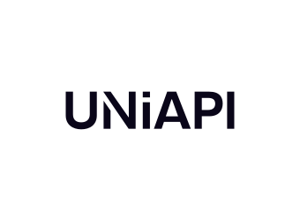

<div align="center">
   <!-- 插入图标 -->
</div>

<div align="center">
  <h3>Universal LLM API Integration Toolkit</h3>
  <p><i>"One Standard to Call Them All"</i></p>
  <a href="https://opensource.org/licenses/MIT"></a>
  <a href="https://en.cppreference.com/w/cpp/compiler_support"></a>
  <a href="https://developer.nvidia.com/cuda-toolkit"></a>
  <a href="https://hub.docker.com/r/ryoshi541/uniapi"></a>
</div>

---
## Star History

<a href="https://www.star-history.com/#NGLSG/UniAPI&Date">
 <picture>
   <source media="(prefers-color-scheme: dark)" srcset="https://api.star-history.com/svg?repos=NGLSG/UniAPI&type=Date&theme=dark" />
   <source media="(prefers-color-scheme: light)" srcset="https://api.star-history.com/svg?repos=NGLSG/UniAPI&type=Date" />
   
 </picture>
</a>

<a id="how-to-support-this-project"></a>
## 🌟 How to Support This Project

We are committed to continuously improving UniAPI and adding new features. Your support is crucial for the ongoing development of this project. Here are a few ways you can help:

- **Give Us a Star**  
  If you find UniAPI useful, please give us a star on [GitHub](https://github.com/NGLSG/UniAPI). It helps us gain more visibility and attract more contributors.

- **Contribute to the Project**  
  We welcome contributions from the community! Whether it's fixing bugs, adding new features, or improving documentation, every contribution is valuable. To get started, simply fork the repository and submit a pull request.

- **Spread the Word**  
  Share UniAPI with your friends, colleagues, and on social media. The more people who know about this project, the better!

- **Provide Feedback**  
  Your feedback is important to us. If you have any suggestions, ideas, or encounter any issues, please don't hesitate to [open an issue on GitHub](https://github.com/NGLSG/UniAPI/issues).

Thank you for your support! Together, we can make UniAPI even better.

---

## 📋 Table of Contents

- [Language Selection](#language-selection)
- [Features](#features)
- [Todo](#todo)
- [Local Model Support](#local-model-support)
- [Configuration File Editor](#config-file-editor)
- [Installation Methods](#installation-methods)
- [Custom Configuration Rule Explanation](#custom-configuration-rule-explanation)
- [Example Configurations](#example-configurations)
- [License](#license)

---

<a id="language-selection"></a>
## 📖 Language Selection
- [Japanese Version](#japanese)
- [Chinese Version](#chinese)
- [English Version](#english)

---

<a id="features"></a>
## ✨ Features
- **Zero Authentication for Rapid Deployment**: No authentication required by default, with support for dynamic provider loading.
- **High-Performance Inference**: Supports CUDA and Vulkan for GPU acceleration, as well as CPU inference.
- **Local Model Support**: Direct inference of local quantized GGML models without additional configuration.
- **Cross-Platform Compatibility**: Supports Windows, Linux, and macOS.
- **Flexible Configuration**: Configure APIs flexibly using the `Config.yaml` file.
- **Highly Extensible**: Adapt to almost any interface using rule-based configuration.

---

<a id="todo"></a>
## 🔨 Todo
- [ ] Authentication System
- [ ] User System
- [ ] Billing System

---

<a id="local-model-support"></a>
## 📦 Local Model Support
UniAPI supports the following inference methods:
- **CUDA**: Accelerated inference using NVIDIA GPUs.
- **Vulkan**: Cross-platform graphics and compute API for non-NVIDIA GPUs.
- **CPU**: Direct inference using the CPU in environments without GPUs.

---

<a id="config-file-editor"></a>
## 🛠️ Configuration File Editor
If you prefer not to manually edit configuration files using a text editor, you can use the [ChatBot GUI Configuration Tool](https://github.com/NGLSG/ChatBot). After editing the configuration with this tool, you can make minor adjustments to use it directly with this project.

---

<a id="installation-methods"></a>
## 🚀 Installation Methods

### Method 1: Using Docker Image (Easiest)
```bash
# Pull the pre-built Docker image
docker pull ryoshi541/uniapi:latest

# Run the container with default configuration
docker run -d -p 8080:8080 ryoshi541/uniapi:latest

# Run with custom configuration
docker run -d -p 8080:8080 \
  -v /path/to/Config.yaml:/app/Config.yaml \
  ryoshi541/uniapi:latest
```

### Method 2: Build Your Own Docker Image
```bash
# Clone the repository
git clone --recursive https://github.com/NGLSG/UniAPI.git     
cd UniAPI

# Build the Docker image
docker build -t uniapi:latest .

# Run the container
docker run -it --rm -p 8080:8080 uniapi:latest
```

### Method 3: Local Compilation

#### 1. Clone Repository with Submodules
```bash
git clone --recursive https://github.com/NGLSG/UniAPI.git     
cd UniAPI
# If submodules were not pulled:
git submodule update --init --recursive
```

#### 2. Install Dependencies
```bash
# Ubuntu/Debian
sudo apt-get update
sudo apt-get install -y \
    git cmake build-essential \
    libvulkan-dev curl libcurl4-openssl-dev \
    libjsoncpp-dev uuid-dev libssl-dev zlib1g-dev
    
# Optional database support
sudo apt-get install -y \
    libmysqlclient-dev \
    libsqlite3-dev \
    libhiredis-dev
```

#### 3. Compile the Project
```bash
mkdir build && cd build
cmake ..
make -j4
```

#### 4. Run the Server
```bash
./bin/UniAPI 8080  # The port can be changed
```

---

<a id="custom-configuration-rule-explanation"></a>
## 📚 Custom Configuration Rule Explanation
UniAPI uses rule-based configuration to adapt to different API interfaces. Below is a detailed explanation of the configuration parameters:

| Parameter | Description |
|-----------|-------------|
| `enable` | Whether to enable this provider |
| `supportSystemRole` | Whether the provider supports the system role |
| `name` | Provider name for identification |
| `model` | Default model name |
| `apiPath` | API endpoint URL with variable placeholders |
| `apiKeyRole` | API key configuration |
| `headers` | Custom HTTP headers |
| `roles` | Role mapping between OpenAI format and provider format |
| `extraMust` | Additional required parameters |
| `promptRole` | Configuration for mapping prompt structure |
| `params` | Additional parameters to send |
| `responseRole` | Response extraction configuration |
| `supportModels` | List of supported models |

---

<a id="example-configurations"></a>
## 📋 Example Configurations

### Gemini API Configuration Example
```yaml
- enable: true
  supportSystemRole: false
  name: mGemini
  model: gemini-2.5-flash-preview-04-17
  apiPath: https://generativelanguage.googleapis.com/v1beta/models/${MODEL}:streamGenerateContent?key=${API_KEY}
  apiKeyRole:
    key: ~
    role: URL
    header: "Authorization: Bearer "
  headers: ~
  vars: ~
  roles:
    system: system
    user: user
    assistant: model
  extraMust:
    - suffix: topK
      path: generationConfig
      content: ${TOPK}
      isStr: false
    - suffix: topP
      path: generationConfig
      content: ${TOPP}
      isStr: false
    - suffix: temperature
      path: generationConfig
      content: ${TEMP}
      isStr: false
    - suffix: presencePenalty
      path: generationConfig
      content: ${PRES}
      isStr: false
    - suffix: frequencyPenalty
      path: generationConfig
      content: ${FREQ}
      isStr: false
  promptRole:
    role:
      suffix: contents
      path: role
      content: content
      isStr: false
    prompt:
      suffix: contents
      path: parts/0/text
      content: content
      isStr: false
  supportModels:
    - gemini-2.5-flash-preview-04-17
  params: []
  responseRole:
    suffix: ""
    content: candidates/content/parts/text
    callback: RESPONSE
    stopFlag: ""
  author: Ryoshi
  version: 1.0
  description: Gemini custom implementation
```

---

<a id="license"></a>
## 📜 License
MIT - Free for commercial and personal use. See [LICENSE](LICENSE) for details.